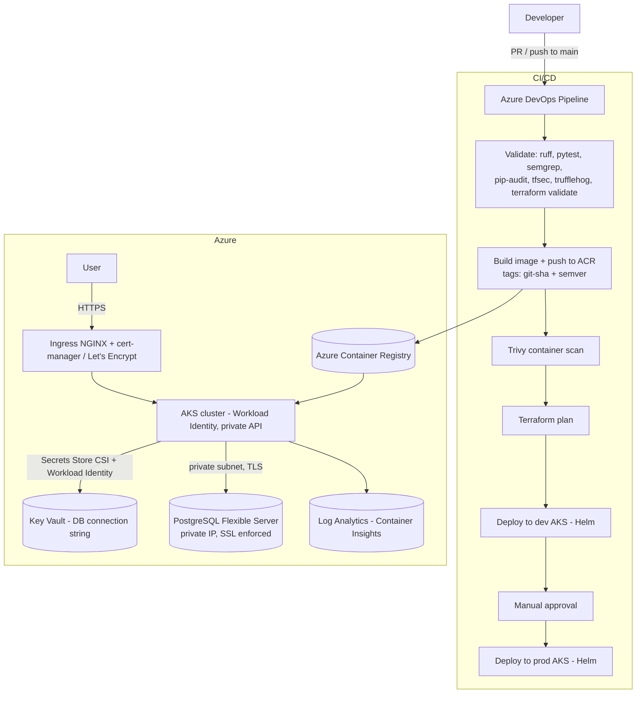

# Healthcare App — Sr. DevOps Take-Home (Azure / AKS)

A FastAPI healthcare app deployed to Azure Kubernetes Service (AKS) with Terraform IaC,
a hand-authored Helm chart, Azure Container Registry, Key Vault (Secrets Store CSI),
private Azure PostgreSQL Flexible Server, and an Azure DevOps CI/CD pipeline with
DevSecOps gates. A GitHub Actions mirror (OIDC) is also included.

- **Azure DevOps org/project:** `https://dev.azure.com/bharathk733833` → `Healthcare-APP`
- **Pipeline:** `Healthcare-APP-CI`
- **Container registry:** `healthcareacr733833.azurecr.io`
- **Clusters:** `aks-healthcare-dev` (`rg-healthcare-dev`), `aks-healthcare-prod` (`rg-healthcare-prod`) — region `centralindia`
- **Terraform remote state:** `rg-terraform` / `tfstatehealthcare` / container `tfstate`

---

## Architecture



Networking: a VNet (`10.20.0.0/16`) with an AKS node subnet, a delegated private subnet
for PostgreSQL Flexible Server (VNet injection + private DNS zone), and a public subnet for
the ingress load balancer. AKS nodes spread across availability zones `["1","2","3"]`.

---

## Deploy commands (in order)

### 0. Prerequisites
```bash
az login
az account set --subscription <SUBSCRIPTION_ID>
# Tooling: terraform >= 1.4, kubectl, helm 3, docker
```

### 1. Terraform — provision infrastructure (per environment)
```bash
cd terraform/azure

# One-time: remote state backend (already provisioned for this assessment)
#   rg-terraform / tfstatehealthcare / container "tfstate"

terraform init \
  -backend-config="resource_group_name=rg-terraform" \
  -backend-config="storage_account_name=tfstatehealthcare" \
  -backend-config="container_name=tfstate" \
  -backend-config="key=healthcare-azure-dev.tfstate"

terraform plan  -var-file=environments/dev.tfvars -out=tfplan
terraform apply tfplan          # the CI pipeline uses `plan` only (see Notes)
```
The DB password is **generated by Terraform** (`random_password`) and written only to
Key Vault + encrypted state — never to git. The full connection string is exposed as the
sensitive output `database_connection_string`.

### 2. Build & push the image (CI does this automatically)
```bash
az acr login --name healthcareacr733833
docker build -t healthcareacr733833.azurecr.io/healthcare-app:$(git rev-parse HEAD) .
docker push  healthcareacr733833.azurecr.io/healthcare-app:$(git rev-parse HEAD)
```

### 3. Deploy with Helm
```bash
az aks get-credentials -g rg-healthcare-dev -n aks-healthcare-dev --overwrite-existing

helm upgrade --install healthcare-app charts/healthcare-app \
  --namespace healthcare-dev --create-namespace \
  --set image.repository=healthcareacr733833.azurecr.io/healthcare-app \
  --set image.tag=$(git rev-parse HEAD)
```

### 4. Ingress + TLS (cert-manager + Let's Encrypt)
```bash
helm repo add jetstack https://charts.jetstack.io && helm repo update
helm install cert-manager jetstack/cert-manager -n cert-manager --create-namespace --set installCRDs=true
helm repo add ingress-nginx https://kubernetes.github.io/ingress-nginx && helm repo update
helm install ingress-nginx ingress-nginx/ingress-nginx -n ingress-nginx --create-namespace
kubectl apply -f k8s/cluster-issuer.yaml   # edit the email first
```

### Rollback
```bash
helm history healthcare-app -n healthcare-dev
helm rollback healthcare-app <REVISION> -n healthcare-dev   # or omit <REVISION> for previous
```
The pipeline deploy steps auto-attempt `helm rollback` if a release upgrade fails.

---

## Design decisions

- **Why Azure + AKS:** managed Kubernetes with first-class Workload Identity (OIDC
  federation), Key Vault CSI, private networking, and Azure Monitor integration — the
  fastest path to a HITRUST-aligned, secrets-free runtime.
- **Why Workload Identity Federation over static SP keys:** federated tokens are
  short-lived and scoped; there are no long-lived client secrets to leak, rotate, or scan
  for. Terraform enables `oidc_issuer_enabled` + `workload_identity_enabled` on AKS, and the
  GitHub Actions mirror authenticates via `azure/login` OIDC (no secrets stored).
- **Why generated DB password:** the password is created by `random_password` and stored
  only in Key Vault + encrypted state, so no secret ever lands in git or pipeline YAML.
- **Why reusable modules:** `terraform/modules/azure_{network,aks,postgres,keyvault,acr}`
  keep each concern composable and independently testable; `environments/{dev,prod}.tfvars`
  hold all per-env values (no hardcoding in the root module).
- **Why remote state with locking:** the `azurerm` backend on Blob Storage uses blob leases
  for state locking, preventing concurrent-apply corruption.

---

## HITRUST control mapping

| HITRUST domain | How it's satisfied | Where (file) |
|---|---|---|
| **Access Control (01)** — least privilege | AKS RBAC enabled; Key Vault uses RBAC authorization (no broad access policies); ACR `admin_enabled=false`; Workload Identity scopes pod→KV access. Service connection / WIF identity should hold only `AcrPush` + `Contributor` on the resource groups. | `terraform/modules/azure_aks/main.tf` (`role_based_access_control_enabled`), `terraform/modules/azure_keyvault/main.tf` (`enable_rbac_authorization`), `terraform/modules/azure_acr/main.tf` |
| **Audit Logging (06)** | AKS `oms_agent` ships control-plane + container logs/metrics to a Log Analytics workspace (Container Insights), 30-day retention. Extend with diagnostic settings on KV/PG for full coverage. | `terraform/azure/main.tf` (`azurerm_log_analytics_workspace`), `terraform/modules/azure_aks/main.tf` (`oms_agent`) |
| **Encryption (10)** — at rest / in transit | At rest: Azure-managed encryption for PG, ACR, KV, Blob state. In transit: PostgreSQL `require_secure_transport=ON` + `sslmode=require` in the connection string; ingress terminates HTTPS via cert-manager/Let's Encrypt. Key management: Key Vault (purge protection + soft delete). | `terraform/modules/azure_postgres/main.tf` (`require_ssl`), `terraform/modules/azure_keyvault/main.tf`, `charts/healthcare-app/templates/ingress.yaml`, `k8s/cluster-issuer.yaml` |
| **Configuration Management (09)** — drift / no manual changes | All infra is Terraform with a locked remote backend; `terraform plan` in CI surfaces drift; `terraform fmt -check` + `validate` block malformed config. Helm renders deployments declaratively. | `terraform/azure/backend.tf`, `azure-pipelines.yml` (Validate stage), `charts/healthcare-app/` |
| **Vulnerability Management (10)** | Container CVEs: Trivy gate (blocks on fixable CRITICAL). Dependency CVEs: `pip-audit`. IaC misconfig: `tfsec` (blocks on CRITICAL). SAST: `semgrep`. | `azure-pipelines.yml` (Validate + BuildAndPush stages) |
| **Network Security (08)** | PostgreSQL is private-only (`public_network_access_enabled=false`, VNet-injected, private DNS); AKS private API server; NetworkPolicy restricts pod egress to DB (5432) + DNS (53); KV `network_acls default_action=Deny`. | `terraform/modules/azure_postgres/main.tf`, `terraform/modules/azure_network/main.tf`, `terraform/modules/azure_aks/main.tf` (`private_cluster_enabled`), `charts/healthcare-app/templates/networkpolicy.yaml` |
| **Secrets Management (10)** | Secrets live only in Key Vault; pods read them via the Secrets Store CSI driver + Workload Identity (no Kubernetes Secrets in git). DB password is generated, never committed. CSI rotation enabled. | `terraform/modules/azure_keyvault/main.tf`, `charts/healthcare-app/templates/secretproviderclass.yaml`, `terraform/modules/azure_aks/main.tf` (`key_vault_secrets_provider { secret_rotation_enabled }`) |

---

## CI/CD pipeline

Triggers on **PR and push to `main`**. Stages:

1. **Validate** — `ruff` lint → `pytest` → `semgrep` (SAST) → `pip-audit` (deps) →
   `terraform fmt -check` + `validate` → `tfsec` (IaC, **blocks on CRITICAL**) →
   `trufflehog` (secret scan, advisory) → AI PR review (PRs only, non-blocking).
2. **BuildAndPush** — docker build, push to ACR tagged with **Git SHA + semver
   (`1.0.<buildId>`)**, then **Trivy** container scan (blocks on fixable CRITICAL).
3. **TerraformPlan** — `terraform init` (remote backend) + `plan`.
4. **DeployDev** — Helm deploy to `aks-healthcare-dev` (with rollback-on-failure).
5. **Approval** — manual approval gate before prod.
6. **DeployProd** — Helm deploy to `aks-healthcare-prod` (with rollback-on-failure).

### DevSecOps gates (blocking vs. soft-fail)

| Gate | Tool | Behavior |
|---|---|---|
| SAST | semgrep | blocks on findings |
| Dependency scan | pip-audit | blocks on known CVEs |
| Container scan | Trivy | blocks on **fixable** CRITICAL (`--ignore-unfixed`) |
| IaC scan | tfsec | **blocks on CRITICAL**; full report soft-fail |
| Secret scan | trufflehog | advisory (justified soft-fail, see below) |

**Justified soft-fails:**
- *Trivy `--ignore-unfixed`*: the `python:3.12-slim` base ships unpatched distro CVEs with
  no upstream fix; blocking on them would wedge every build. We block on anything fixable.
- *trufflehog advisory*: the only credential-looking string in the tree is a clearly
  labeled local demo login in `main.py`; real secrets live in Key Vault. `--only-verified`
  keeps it from failing on non-verifiable strings.

### Successful pipeline run (screenshot)

> **Screenshot placeholder.** This environment is headless (no browser), so a live image
> can't be captured here. Reference the real runs in Azure DevOps:
>
> - Pre-assessment green run: **#68** (all 6 stages succeeded) — commit `5c135e0`
> - Post-assessment green run: **#72** — all 6 stages succeeded (Validate, Build & Push,
>   Terraform Plan, Deploy Dev, Approval, Deploy Prod) — commit `66c03c4`
> - Link: `https://dev.azure.com/bharathk733833/Healthcare-APP/_build/results?buildId=72`
>
> Embed `docs/pipeline-success.png` here when running with a UI.

### Cloud auth — current state and upgrade path

The Azure DevOps service connection (`AzureServiceConnection`) is currently a
**manual app-registration with a client secret** (static SP key). This is the one place a
long-lived secret still exists. **Upgrade path (documented, recommended):** recreate it as a
**Workload Identity Federation** service connection (`az devops service-endpoint azurerm
create --azure-rm-service-principal-id <id> ... ` with a federated credential, or via the
portal "Workload identity federation (automatic)"). The included GitHub Actions workflow
(`.github/workflows/ci.yml`) already uses **OIDC/WIF** with `azure/login` and no stored
secrets, demonstrating the target state.

---

## AI-augmented automation

`scripts/ai_pr_review.py` is a runnable AI PR reviewer: it reads a unified diff (stdin or
file), sends it to an OpenAI-compatible chat endpoint, prints a security/IaC/CI review, and
(when ADO PR env vars are present) posts the review back as a PR thread comment. It's wired
into the pipeline as a **non-blocking** step that runs only on pull requests and skips
cleanly when `OPENAI_API_KEY` is unset (forks/local).

Run it locally:
```bash
git diff origin/main...HEAD | OPENAI_API_KEY=sk-... python scripts/ai_pr_review.py
```

**AI-generated vs. hand-written (honest):**
- *AI assisted:* drafting the Helm/Terraform boilerplate scaffolding and the first cut of
  this README's prose and the PR-review prompt.
- *Hand-written / hand-verified:* the Terraform hardening decisions (private PG + delegated
  subnet + private DNS, Workload Identity, KV RBAC/purge), the pipeline gate wiring and
  justified soft-fails, and **every change was validated locally** (`terraform fmt`,
  `validate`, `plan` = 16 to add, `tfsec --minimum-severity CRITICAL` = 0 findings) before
  pushing. AI did **not** choose security trade-offs unverified.

---

## What I'd improve given more time (prioritized)

1. **Convert the ADO service connection to WIF** (remove the last static SP secret).
2. **Wire runtime Workload Identity end-to-end** — create the user-assigned identity +
   federated credential per namespace/SA, grant `Key Vault Secrets User`, set the client id
   in chart values so the CSI mount actually populates `db-credentials` at runtime.
3. **`terraform apply` the hardened stack** behind a real apply stage (currently plan-only to
   avoid cost), with a private DevOps agent that can reach the private API server.
4. **Diagnostic settings** on Key Vault and PostgreSQL → Log Analytics for full audit trail.
5. **infracost** PR comments and an OPA/Conftest policy gate on the Helm output.
6. **Real ADO Environment approval check** on `prod-aks` (vs. the in-pipeline placeholder).

## Known limitations / stubs

- **Terraform is plan-only in CI** (the assessment allows this). The running dev/prod
  clusters were pre-provisioned via Azure CLI for the deploy demo; the Terraform models a
  hardened *private* cluster that is validated by `plan` but not applied.
- **Runtime secret injection is not fully wired** — the CSI `SecretProviderClass` and
  Workload Identity scaffolding are in place, but the federated identity + role assignment
  must be created for the pod to actually read Key Vault at runtime (steps documented above).
- **Ingress/TLS** is authored (chart + ClusterIssuer) but cert-manager/ingress-nginx are
  installed manually (commands above), not via the pipeline.
- **Pipeline screenshot** is a labeled placeholder (headless environment).

## Bonus items

- ✅ **GitHub Actions mirror** with OIDC — `.github/workflows/ci.yml`
- ✅ **Monitoring** — AKS Container Insights → Log Analytics (Terraform)
- ✅ **Backup/DR one-pager** — `docs/BACKUP-DR.md`
- ⬜ **infracost / multi-cloud abstraction** — not done (time-boxed); would add an infracost
  CI step and a thin provider-agnostic module interface.

## Repository layout
```
main.py                       FastAPI app
Dockerfile, requirements.txt  container build
charts/healthcare-app/        Helm chart (deployment, service, hpa, networkpolicy,
                              ingress, serviceaccount, secretproviderclass)
terraform/azure/              root module + environments/{dev,prod}.tfvars
terraform/modules/azure_*/    reusable network/aks/postgres/keyvault/acr modules
azure-pipelines.yml           Azure DevOps CI/CD
.github/workflows/ci.yml      GitHub Actions mirror (OIDC)
scripts/ai_pr_review.py       AI PR review automation
k8s/cluster-issuer.yaml       Let's Encrypt ClusterIssuer
docs/BACKUP-DR.md             backup & disaster-recovery plan
```
